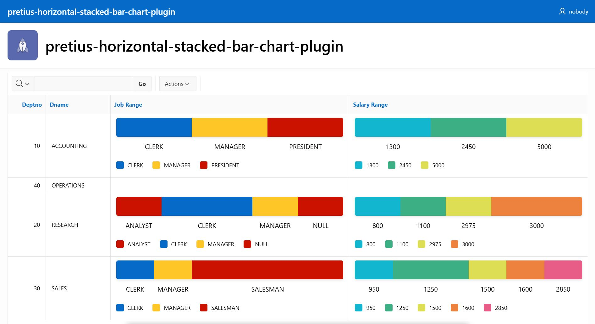

# Pretius Horizontal Stacked Bar Chart - Oracle APEX Plugin

  


This plugin provides a horizontal stacked bar chart component for Oracle APEX applications. It is a template component plugin, meaning it can be used within APEX regions to render interactive and visually appealing stacked bar charts.



## Features

*   **Horizontal Stacked Bar Chart:** Displays data as a horizontal stacked bar chart, allowing for easy comparison of different segments within a category.
*   **JSON Data Input:** Accepts chart data in JSON format, making it flexible and easy to integrate with various data sources.
*   **Customizable Appearance:** Offers several options to customize the chart's appearance, including:
    *   Showing or hiding labels, legends, percentages and values.
    *   Setting the height and minimum width of the chart.
    *   Applying different styles using Universal Theme or custom CSS classes.
*   **Tooltips:** Displays tooltips on hover to show detailed information about each segment.
*   **Responsive Design:** Adapts to different screen sizes, ensuring optimal viewing on various devices.

## Installation

1.  **Import the Plugin:** Import the `template_component_plugin_pretius_horizontal_stacked_bar_chart.sql` file into your Oracle APEX application.
2.  **Install the Plugin:** Follow the on-screen instructions to install the plugin.

## Usage

1.  **Create a Region/Interactive Report:** Create a region in your APEX page where you want to display the chart.
2.  **Set Region Type/IR Column Type:** Set the region type to "Plug-in" and select "Pretius Horizontal Stacked Bar Chart".
3.  **Configure Attributes:** Configure the plugin attributes in the region settings:
    *   **Chart Data JSON Column:** Specify the column containing the JSON data for the chart.
    *   **Show Labels:** Choose whether to display labels for each segment.
    *   **Show Legend:** Choose whether to display a legend for the chart.
    *   **Show Percentages:** Choose whether to display percentages for each segment.
    *   **Show Values:** Choose whether to display values for each segment.
    *   **Show Tooltips:** Choose whether to display tooltips on hover.
    *   **Height:** Set the height of the chart (e.g., `40px`).
    *   **Min Width:** Set the minimum width of the chart (e.g., `auto`).
    *   **Style:** Select the style for the chart segments. Options include:
        *   `COLOR`: JSON Style Tag = Color HEX (e.g., #123456)
        *   `CLASS`: JSON Style Tag = Color Class (e.g., u-warning-bg)
        *   `UT`: Universal Theme (u-color-1-bg is used for the 1st segment, u-color-2-bg for the 2nd, u-color-3-bg for the 3rd, etc.)
        *   `UT_ODD`: Universal Theme (Odd) (u-color-1-bg is used for the 1st segment, u-color-3-bg for the 2nd, u-color-5-bg for the 3rd, etc.)
        *   `UT_EVEN`: Universal Theme (Even) (u-color-2-bg is used for the 1st segment, u-color-4-bg for the 2nd, u-color-6-bg for the 3rd, etc.)

## JSON Data Format

The plugin expects the chart data to be in the following JSON format:

```JSON
{
  "records": [
    {
      "label": "Segment 1",
      "value": 30,
      "style": "#FF0000"
    },
    {
      "label": "Segment 2",
      "value": 50,
      "style": "#00FF00"
    },
    {
      "label": "Segment 3",
      "value": 20,
      "style": "#0000FF"
    }
  ]
}
```

*   `label`: The label for the segment (string).
*   `value`: The value of the segment (number).
*   `style`: The style of the segment (string). This can be a color hex code, a CSS class, or any other valid CSS style.

## Example

Here's an example of how to use the plugin with a SQL query:

```SQL
SELECT d.deptno,
       d.dname,
       /* Start of JSON */
        (SELECT 
            JSON_OBJECT(
                'records' VALUE 
                    JSON_ARRAYAGG(
                        JSON_OBJECT(
                            'label' VALUE e.job, -- Label
                            'value' VALUE COUNT(*), -- value
                            'style' VALUE CASE e.job -- Optional Styling
                                WHEN 'MANAGER' THEN 'u-warning-bg' 
                                WHEN 'CLERK' THEN 'u-info-bg'
                                ELSE 'u-danger-bg' END
                        )
                        ORDER BY e.job -- Order by Label
                    )
            ) AS chart_data 
        FROM emp e -- Child Table
        WHERE e.deptno = d.deptno -- Join to the Parent Table
        GROUP BY e.job) chart_data
        /* End  of JSON */
  FROM dept d -- Parent Table
 ORDER BY dname
```

1.  Create an Interactive Report region.
2.  Set the source of the Interactive Report to the above SQL query.
3.  Set the "Chart Data JSON Column" attribute of the Pretius Horizontal Stacked Bar Chart plugin to `CHART_DATA`.
4. Run the Page

## With/Apply Method

Use this in a HTML Expression of your Interactive Report Column

````
{with/}
 CHART_DATA:=#CHART_DATA#
 SHOW_LABELS:=Y
 SHOW_LEGEND:=Y
 SHOW_PERCENTAGES:=Y
 SHOW_VALUES:=Y
 SHOW_TOOLTIPS:=Y
 HEIGHT:=40px
 MIN_WIDTH:=auto
 STYLE:=UT_EVEN
{apply PRETIUS_HORIZONTAL_STACKED_BAR_CHART/}
````

## JavaScript and CSS Files

The plugin uses the following JavaScript and CSS files:

*   `pretius-hsbc-script.js`: Contains the JavaScript code for rendering the chart.
*   `pretius-hsbc-style.css`: Contains the CSS styles for the chart.
*   `pretius-hsbc-script.min.js`: Minified version of the JavaScript file
*   `pretius-hsbc-style.min.css`: Minified version of the CSS file

These files are automatically uploaded during plugin installation.

## Versioning

*   24.2.1 - Initial Release

## Author

Developed by [Matt Mulvaney](https://x.com/Matt_Mulvaney) at <a href="https://www.pretius.com" title="https://www.pretius.com">Pretius</a>. 

## Demo

[Click here](https://apex.oracle.com/pls/apex/r/luf/pretius-horizontal-stacked-bar-chart-plugin)

## License

Licensed under the [MIT](LICENSE) license.

## Free support
Pretius provides free support for the plugins at the GitHub platform. 
We monitor raised issues, prepare fixes, and answer your questions. However, please note that we deliver the plug-ins free of charge, and therefore we will not always be able to help you immediately. 

Interested in better support? 
* [Become a contributor!](#become-a-contributor) We always prioritize the issues raised by our contributors and fix them for free.
* [Consider comercial support.](#commercial-support) Options and benefits are described in the chapter below.

### Bug reporting and change requests
Have you found a bug or have an idea of additional features that the plugin could cover? Firstly, please check the Roadmap and Known issues sections. If your case is not on the lists, please open an issue on a GitHub page following these rules:
* issue should contain login credentials to the application at apex.oracle.com where the problem is reproduced;
* issue should include steps to reproduce the case in the demo application;
* issue should contain description about its nature.

### Implementation issues
If you encounter a problem during the plug-in implementation, please check out our demo application. We do our best to describe each possible use case precisely. If you can not find a solution or your problem is different, contact us: apex-plugins@pretius.com.

## Become a contributor!
We consider our plugins as genuine open source products, and we encourage you to become a contributor. Help us improve plugins by fixing bugs and developing extra features. Comment one of the opened issues or register a new one, to let others know what you are working on. When you finish, create a new pull request. We will review your code and add the changes to the repository.

By contributing to this repository, you help to build a strong APEX community. We will prioritize any issues raised by you in this and any other plugins.

## Commercial support
We are happy to share our experience for free, but we also realize that sometimes response time, quick implementation, SLA, and instant release for the latest version are crucial. That’s why if you need extended support for our plug-ins, please contact us at apex-plugins@pretius.com.
We offer:
* enterprise-level assistance;
* support in plug-ins implementation and utilization;
* dedicated contact channel to our developers;
* SLA at the level your organization require;
* priority update to next APEX releases and features listed in the roadmap.